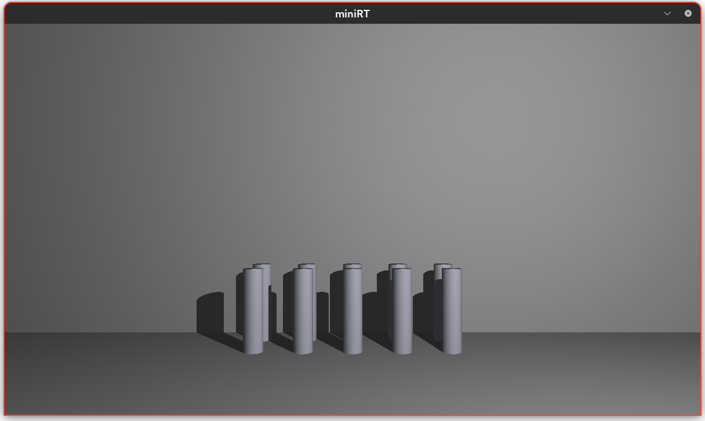
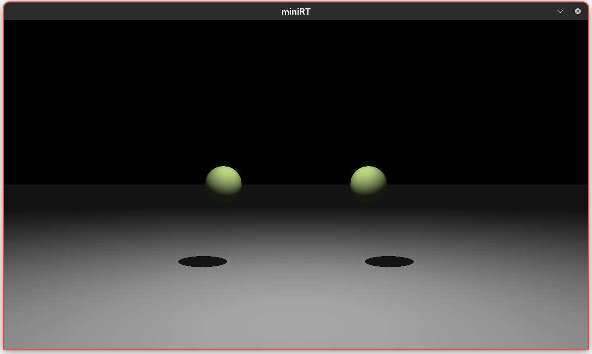
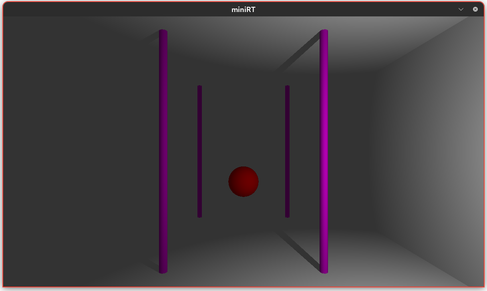

# miniRT_42

A minimal ray tracer written in C. It renders 3D scenes with basic shapes, lighting, and shadows using MiniLibX.

## Features

- Renders 3D scenes with basic geometric shapes (such as spheres, planes, and cylinders)
- Implements basic lighting and shadows
- Uses the MiniLibX graphical library for rendering
- Written in C for performance and portability

## Preview

Here are some example renders from `miniRT_42`:

### Cylinders Example

### Spheres Example

### Scene Example


## Getting Started

### Prerequisites

- GCC or a compatible C compiler
- [MiniLibX](https://harm-smits.github.io/42docs/libs/minilibx) library
- Make (optional, for using provided Makefile)

### Building

Clone the repository:

```sh
git clone https://github.com/nerovanity/miniRT_42.git
cd miniRT_42
```

Compile the project (assuming Makefile is provided):

```sh
make
```

Or compile manually:

macos:
```sh
gcc -o miniRT main.c ... -lmlx -lm -framework OpenGL -framework AppKit
```
linux:
```sh
gcc -o miniRT main.c ...-lX11 -lXext -lmlx -lm
```
> **Note**: Adjust the compiler flags and source files as needed for your system and project structure.

### Running

```sh
./miniRT [scene_file.rt]
```

## Usage

- Provide a `.rt` scene description file as an argument.
- The window will open displaying the rendered scene.
- Close the window to exit the program or press esc.

## Credits

Developed by [nerovanity](https://github.com/nerovanity) and [Essoufi-oussama](https://github.com/Essoufi-oussama) as part of the 42 School curriculum.
